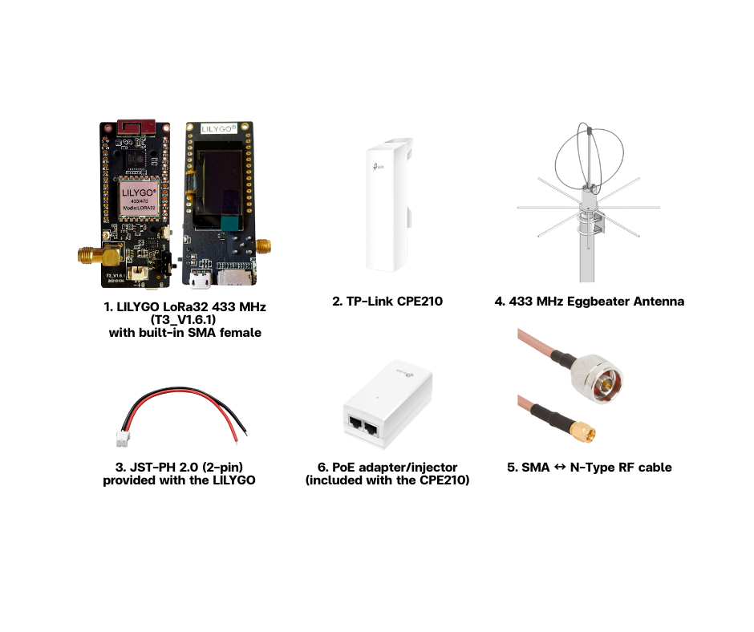
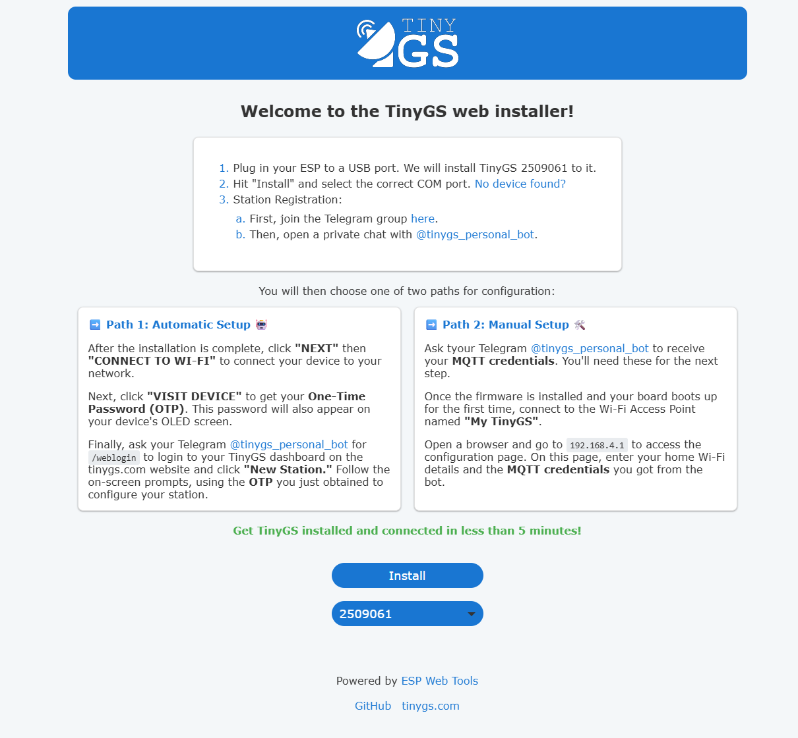
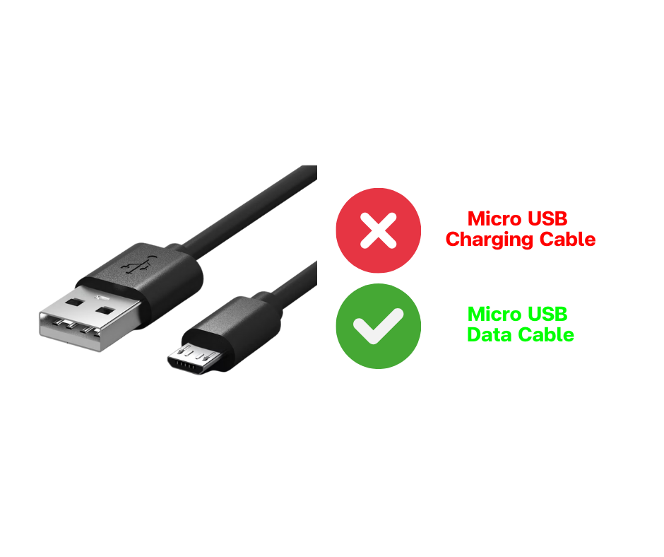
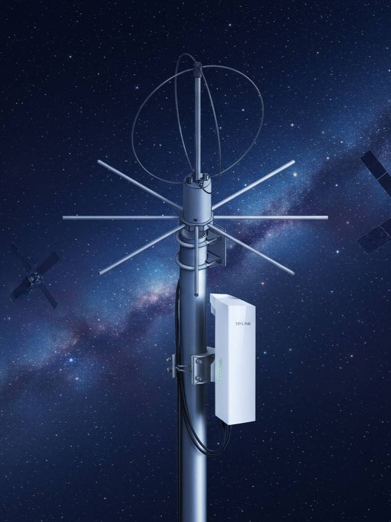

# SatFinder TinyGS Node (LILYGO LoRa32 433 + TP-Link CPE210 + Eggbeater)

This repository provides a **single-file, end-to-end build guide** for deploying a SatFinder LoRa node using:

- **TinyGS** firmware (flashed via Web Installer)
- **LILYGO LoRa32 433 MHz (T3_V1.6.1)** (built-in **SMA female**)
- **TP-Link CPE210** (provides an onboard **3.3V header** to power the LILYGO)
- **433 MHz Eggbeater Antenna** (SatFinder standard)
- A provided **SMA ↔ N-Type RF cable (~50 cm)** routed from inside the CPE210 to the outside, then connected directly to the Eggbeater.

---

## 1) Scope and Design Choices

### What this repo covers
- Configuring **CPE210 Wi-Fi SSID/Password (2.4 GHz)** using SatFinder naming rules
- Connecting **CPE210 to the included PoE adapter** and to an **unauthenticated Internet uplink**
- Flashing **TinyGS** on LILYGO LoRa32 (T3_V1.6.1, 433 MHz) via the official web installer
- Mechanical integration inside a TP-Link CPE210 enclosure
- Powering LILYGO from the CPE210’s **3.3V header** using the provided **JST-PH 2.0** cable
- Routing LoRa RF out of the enclosure using the provided **SMA-to-N Type** cable to an **Eggbeater antenna**
- Standardized station naming and recommended SCHOOL code rules

### What this repo does not cover
- Network planning and site survey (RF path planning / Wi-Fi link design)
- Advanced TinyGS tuning (SF/BW/CR optimization)
- Custom PCB/3D printed parts (optional only)

---

## 2) Bill of Materials (BOM)

### Required
- **LILYGO LoRa32 433 MHz (T3_V1.6.1)** with built-in **SMA female**
- **TP-Link CPE210** (with onboard **3.3V header**)
- **JST-PH 2.0 (2-pin)** cable (provided with the LILYGO)
- **433 MHz Eggbeater Antenna** (SatFinder standard)
- **SMA ↔ N-Type RF cable (~50 cm)** (provided by SatFinder)
- **PoE adapter/injector** (included with the CPE210)

### Tools
- Screwdriver (to open the CPE210)
- Multimeter (highly recommended to confirm 3.3V and polarity before connecting)

> Not used in this build: drilling/cutting tools, crimpers, wire strippers, nuts/bolts/washers (per the SatFinder kit workflow).

---

## 3) Configure TP-Link CPE210 Wi-Fi (SSID/Password) — 2.4 GHz

Configure the CPE210 first so the TinyGS node can join the correct Wi-Fi network reliably during field deployment.

### 3.1 Wi-Fi naming rule (project standard)
- **Band**: 2.4 GHz
- **CPE210 SSID**: use the **same string as the SatFinder node name**
  - Format: `SatFinder-<PROV>-<SCHOOL>`
- **CPE210 Password (WPA2-PSK)**: `aa8a7a94` (fixed for all SatFinder nodes)

Example:
- Node/Station name: `SatFinder-CMI-TU`
- CPE210 SSID: `SatFinder-CMI-TU`
- CPE210 Password: `aa8a7a94`

### 3.2 Step-by-step (recommended baseline settings)
1. Power on the CPE210 (see Section 4) and connect a laptop/PC for initial setup.
2. Log in to the CPE210 management interface (IP/URL may vary by configuration).
3. Go to **Wireless** settings:
   - Set **Wireless Mode / Radio** to **2.4 GHz** (CPE210 is 2.4 GHz by design)
   - Set **SSID** to `SatFinder-<PROV>-<SCHOOL>`
   - Set **Security** to **WPA2-PSK (AES)** (recommended)
   - Set **Password** to `aa8a7a94`
4. Save/apply settings and confirm the SSID is visible in Wi-Fi scan results.
5. (Recommended) Disable features that may introduce surprises in the field:
   - Avoid captive portal / web authentication features (if present)
   - Ensure the SSID broadcast is enabled (not hidden) for simpler field operations

> Operational note: Using the same SSID as the node name improves identification and reduces mis-association during multi-site deployments.

---

## 4) Connect CPE210 to PoE Adapter and Internet Uplink (No Authentication)

TinyGS requires normal Internet connectivity and **does not support network authentication flows** (e.g., captive portal login, 802.1X, web-based sign-in).

### 4.1 PoE adapter wiring (included with CPE210)
Typical PoE injector ports:
- **LAN** (data in from the network)
- **PoE** (data + power out to the CPE210)

Steps:
1. Connect an Ethernet cable from the **PoE** port of the injector to the **Ethernet port on the CPE210**.
2. Connect an Ethernet cable from the school network/internet source to the **LAN** port of the injector.
3. Plug the injector’s power adapter into AC mains.

### 4.2 Internet uplink requirement (critical)
- The Ethernet uplink connected to the injector **LAN** port must provide Internet access **without requiring any authentication**, such as:
  - Captive portal (browser login page)
  - 802.1X / enterprise authentication
  - PPPoE credentials
  - Any web-based sign-in workflow

**Recommended approach for schools**
- Use a standard router/switch port that provides DHCP + Internet directly (no sign-in).
- If the school network requires authentication, provide a separate small router upstream that performs the authentication (if applicable) and exposes a normal NAT/DHCP LAN to the CPE210.

### 4.3 Quick verification checklist
- The laptop connected to the same uplink can open a normal website **without** logging in.
- DHCP lease is issued normally.
- No “Sign in to network” prompt appears on client devices.

---

## 5) Flash TinyGS on LILYGO (Web Installer)

### 5.1 Requirements
- Browser: **Chrome** or **Microsoft Edge** (Web Serial supported)
- A stable USB cable (avoid data dropouts during flashing)

### 5.2 Flash steps
1. Connect the LILYGO board to your computer via USB
2. Open the official TinyGS Web Installer:  
   https://installer.tinygs.com/
3. Select the correct device/board profile for **ESP32 + SX127x** (LILYGO LoRa32 family)
4. Click **Install/Flash**, then select the correct serial port (COM)
5. Wait until the process completes (do not disconnect USB during flashing)

### 5.3 Provisioning checklist (after flashing)
- Set TinyGS Wi-Fi SSID / Password to match Section 3:
  - SSID: `SatFinder-<PROV>-<SCHOOL>`
  - Password: `aa8a7a94`
- Confirm LoRa region/frequency plan is **433 MHz**
- Set a station/device name following SatFinder naming rules (Section 8)

---

## 6) Integrate LILYGO into TP-Link CPE210

### 6.1 Open the CPE210
1. Disconnect power
2. Open the enclosure carefully (avoid damaging internal cables)
3. Locate the onboard **3.3V header** (provided on the CPE210 PCB)

### 6.2 Place the LILYGO safely
- Ensure the LILYGO board does **not** touch conductive surfaces
- Use insulation under the board (e.g., thin plastic sheet / Kapton tape / insulation tape)
- Route cables so they are not pinched when closing the enclosure

---

## 7) Power Wiring: CPE210 3.3V Header → JST-PH 2.0 → LILYGO

**Verified field behavior (SatFinder build):**  
The CPE210 onboard 3.3V header can power the LILYGO stably via the JST-PH 2.0 cable.

### 7.1 Wiring principle
- **CPE210 3.3V** → **JST red wire** → LILYGO (JST-PH)
- **CPE210 GND** → **JST black wire** → LILYGO (JST-PH)

### 7.2 Safety checklist (recommended)
- Confirm polarity at the 3.3V header (do not assume)
- If possible, use a multimeter:
  - Measure ~3.3V between the intended 3.3V pin and GND
- Only connect JST after polarity is confirmed

### 7.3 Power-on test
1. Power the CPE210 normally
2. Confirm the LILYGO boots (LED / OLED status / TinyGS connectivity)
3. Confirm TinyGS comes online after Wi-Fi association

---

## 8) LoRa Antenna and RF Cable Routing (SMA → N-Type → Eggbeater)

### 8.1 SatFinder antenna standard
- Use **433 MHz Eggbeater Antenna** as the standard SatFinder LoRa antenna.

### 8.2 RF connection workflow
1. Inside the CPE210:
   - Connect the **SMA end** of the provided **SMA↔N Type (~50 cm)** cable to the LILYGO’s **SMA female**
2. Route the cable out of the CPE210:
   - Use existing cable exits / routing paths (no drilling required for this kit workflow)
   - Ensure the cable is not sharply bent or crushed by enclosure edges
3. Outside the CPE210:
   - Connect the **N-Type end** directly to the **Eggbeater antenna**

### 8.3 Best practices
- Avoid tight 90° bends; keep gentle curves to protect the coax and connector integrity
- Provide strain relief so the SMA connector on the LILYGO does not take mechanical load

---

## 9) Station Naming Convention

### 9.1 Naming format
**SatFinder-<PROV>-<SCHOOL>**

- `<PROV>`: Province abbreviation in Thailand  
- `<SCHOOL>`: School abbreviation (project-governed identifier)

### 9.2 Province abbreviations reference
https://th.wikipedia.org/wiki/รายชื่ออักษรย่อของจังหวัดในประเทศไทย

> Recommendation: Prefer **Roman/ASCII abbreviations** to maximize compatibility with dashboards, logs, and IoT systems.

---

## 10) Recommended SCHOOL rules (project standard)

To prevent duplicated or inconsistent SCHOOL codes across deployments, apply the following rules:

1) Use uppercase ASCII letters and digits only: **[A–Z, 0–9]**  
2) Length: **2–6 characters** (recommended 3–5)  
3) Uniqueness: must be unique within the same province (ideally nationwide)  
4) Once used in a deployed station, do not change without a migration plan (to preserve dashboards and history)

---

## 11) Quick Examples (15 samples across regions)

| Region (example) | Province | PROV (Roman) | SCHOOL (example) | Station Name / CPE210 SSID |
|---|---|---:|---:|---|
| Central | Bangkok | BKK | TUS | SatFinder-BKK-TUS |
| North | Chiang Mai | CMI | PWS | SatFinder-CMI-PWS |
| North | Chiang Rai | CRI | MHS | SatFinder-CRI-MHS |
| Lower North | Phitsanulok | PLK | SCS | SatFinder-PLK-SCS |
| West | Kanchanaburi | KRI | KWS | SatFinder-KRI-KWS |
| Central | Nakhon Pathom | NPT | NPS | SatFinder-NPT-NPS |
| East | Chonburi | CBI | CBS | SatFinder-CBI-CBS |
| East | Rayong | RYG | RYS | SatFinder-RYG-RYS |
| Northeast | Nakhon Ratchasima | NMA | NMS | SatFinder-NMA-NMS |
| Northeast | Khon Kaen | KKN | KKS | SatFinder-KKN-KKS |
| Northeast | Udon Thani | UDN | UDS | SatFinder-UDN-UDS |
| Northeast | Ubon Ratchathani | UBN | UBS | SatFinder-UBN-UBS |
| South (Andaman) | Phuket | PKT | PKS | SatFinder-PKT-PKS |
| South (Gulf) | Surat Thani | SNI | SNS | SatFinder-SNI-SNS |
| South | Songkhla | SKA | SKS | SatFinder-SKA-SKS |

---

## 12) Final Commissioning Checklist (before closing the enclosure)

- [ ] CPE210 SSID set to `SatFinder-<PROV>-<SCHOOL>` (2.4 GHz)
- [ ] CPE210 Wi-Fi password set to `aa8a7a94`
- [ ] CPE210 connected to PoE injector correctly (PoE → CPE210, LAN → Internet uplink)
- [ ] The Internet uplink requires **no authentication** (no captive portal / 802.1X / PPPoE / web sign-in)
- [ ] TinyGS flashed via https://installer.tinygs.com/
- [ ] TinyGS Wi-Fi configured to match the CPE210 SSID/password
- [ ] LoRa frequency plan is set to **433 MHz**
- [ ] Station name follows `SatFinder-<PROV>-<SCHOOL>`
- [ ] CPE210 powers LILYGO via **3.3V header → JST-PH 2.0** (verified polarity)
- [ ] RF cable **SMA↔N (0.5 m)** is connected and routed safely
- [ ] N-Type connects directly to **Eggbeater antenna**
- [ ] No cable is pinched when closing the CPE210 enclosure

---

## 13) Troubleshooting (common field issues)

### CPE210 has link but no Internet for TinyGS
- Confirm the Ethernet uplink does not require authentication (no captive portal / 802.1X / PPPoE)
- Verify the uplink provides DHCP + Internet directly
- Test the uplink with a laptop: it must browse websites **without** any login

### Device boots but TinyGS stays offline
- Recheck Wi-Fi SSID/password and signal coverage
- Confirm successful flashing via the web installer
- Power-cycle the CPE210 and confirm the LILYGO boots consistently

### Random reboot / unstable behavior
- Confirm 3.3V header polarity and connector firmness
- Ensure cables are not intermittently shorting against metal/ground
- Improve insulation and strain relief

### Poor LoRa reception
- Confirm Eggbeater is for 433 MHz and installed correctly
- Confirm coax is not sharply bent or damaged
- Move the antenna away from obstructions and strong EMI sources

---

## License
MIT
