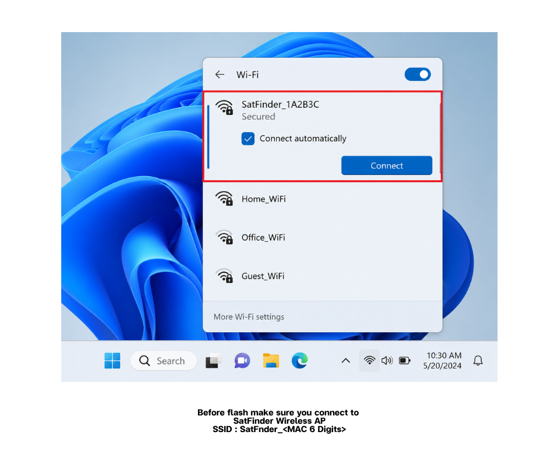
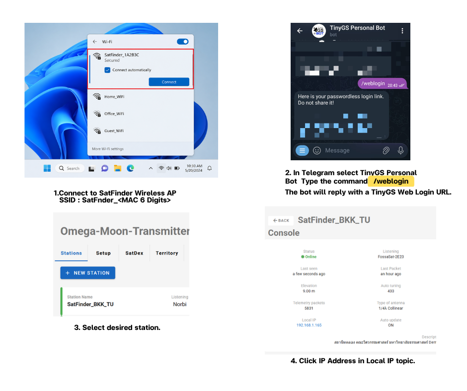
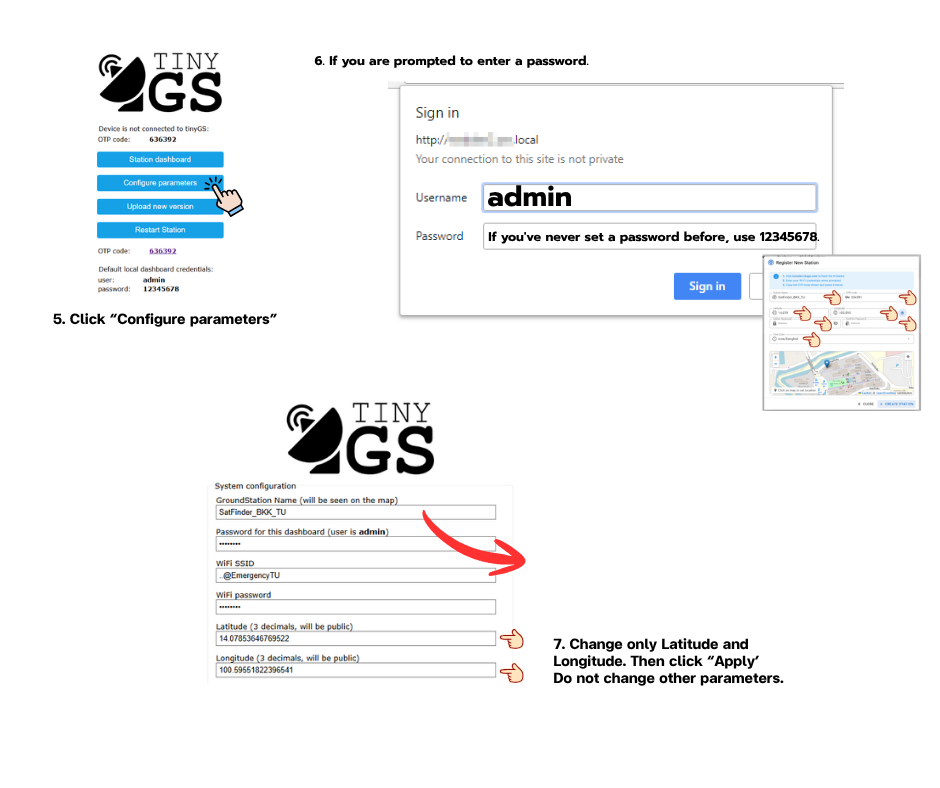

Revision: Rev2.0 | Previous version: [README Rev1.0](./README.rev1.0.md) | Language: English | [ไทย](./README.th.md)

# SatFinder TinyGS Node (LILYGO LoRa32 433 + TP-Link CPE210 + Eggbeater)

This repository provides a **single-file, end-to-end build guide** for deploying a SatFinder LoRa node using:

- **TinyGS** firmware flashed through the Web Installer
- **LILYGO LoRa32 433 MHz (T3_V1.6.1)** with built-in **SMA female**
- **TP-Link CPE210**, already configured by the SatFinder project as the Wi-Fi access point for the node
- **433 MHz Eggbeater Antenna** as the SatFinder antenna standard
- A provided **SMA ↔ N-Type RF cable (~50 cm)** routed from inside the CPE210 to the outside, then connected directly to the Eggbeater

---

## 1) Scope and Design Choices

### What this repo covers
- Using the **project-configured CPE210 Wi-Fi SSID/password** for TinyGS provisioning
- Connecting **CPE210 to the included PoE adapter** and to an **unauthenticated Internet uplink**
- Selecting the required **SatFinder station name** before flashing and provisioning TinyGS
- Flashing **TinyGS** on LILYGO LoRa32 (T3_V1.6.1, 433 MHz) via the official Web Installer
- Registering the new station in TinyGS through Telegram
- Mechanical integration inside a TP-Link CPE210 enclosure
- Powering LILYGO from the CPE210 **3.3V header** using the provided **JST-SH 1.25** cable
- Routing LoRa RF out of the enclosure using the provided **SMA-to-N Type** cable to an **Eggbeater antenna**

### What this repo does not cover
- CPE210 Wi-Fi/AP setup. The project already configures it before field use.
- Network planning and site survey (RF path planning / Wi-Fi link design)
- Advanced TinyGS tuning (SF/BW/CR optimization)
- Custom PCB/3D printed parts (optional only)

---

## 2) Bill of Materials (BOM)

### Required
- **LILYGO LoRa32 433 MHz (T3_V1.6.1)** with built-in **SMA female**
- **TP-Link CPE210** with onboard **3.3V header**
- **JST-SH 1.25 (2-pin)** cable, provided with the LILYGO
- **433 MHz Eggbeater Antenna**, SatFinder standard
- **SMA ↔ N-Type RF cable (~50 cm)**, provided by SatFinder
- **PoE adapter/injector**, included with the CPE210

### Tools
- Screwdriver, to open the CPE210
- Multimeter, highly recommended to confirm 3.3V and polarity before connecting

> Not used in this build: drilling/cutting tools, crimpers, wire strippers, nuts/bolts/washers, per the SatFinder kit workflow.

---

## 3) Use the Project-Configured CPE210 Wi-Fi (No Wi-Fi Setup Step)

The SatFinder project configures the TP-Link CPE210 Wi-Fi before deployment. Do **not** rename the Wi-Fi network during the build.

- **CPE210 SSID**: `SatFinder_<MAC_LAST6>`
- **MAC_LAST6**: the last 6 hexadecimal characters of the MAC address printed on the sticker on the back of the TP-Link CPE210, ignoring separators such as `:` or `-`
- **Wi-Fi password**: `aa8a7a94`
- **Band**: 2.4 GHz

Example:
- Sticker MAC: `AA:BB:CC:12:34:56`
- Last 6 MAC characters, without separators: `123456`
- CPE210 SSID: `SatFinder_123456`
- Password: `aa8a7a94`

Record the SSID from the sticker before TinyGS provisioning. This CPE210 Wi-Fi SSID is used for network connection only; the TinyGS station name still follows the SatFinder naming format in Section 5.

---

## 4) Connect CPE210 to PoE Adapter and Internet Uplink (No Authentication)

TinyGS requires normal Internet connectivity and **does not support network authentication flows** such as captive portal login, 802.1X, or web-based sign-in.

### 4.1 PoE adapter wiring
Typical PoE injector ports:
- **LAN**: data in from the network
- **PoE**: data + power out to the CPE210

Steps:
1. Connect an Ethernet cable from the **PoE** port of the injector to the **Ethernet port on the CPE210**.
2. Connect an Ethernet cable from the school network/internet source to the **LAN** port of the injector.
3. Plug the injector power adapter into AC mains.

### 4.2 Internet uplink requirement
The Ethernet uplink connected to the injector **LAN** port must provide Internet access **without requiring any authentication**, such as:
- Captive portal, browser login page
- 802.1X / enterprise authentication
- PPPoE credentials
- Any web-based sign-in workflow

**Recommended approach for schools**
- Use a standard router/switch port that provides DHCP + Internet directly.
- If the school network requires authentication, use a small upstream router that handles authentication and exposes a normal NAT/DHCP LAN to the CPE210.

### 4.3 Quick verification checklist
- A laptop connected to the same uplink can open a normal website without logging in.
- DHCP lease is issued normally.
- No “Sign in to network” prompt appears on client devices.

---

## 5) Station Naming Convention and Examples

Choose the station name **before** flashing/provisioning TinyGS. The same station name must be used during TinyGS local configuration and TinyGS station registration.

### 5.1 Naming format and SCHOOL rules
**SatFinder_`<PROV>`_`<SCHOOL>`**

- `<PROV>`: province abbreviation in Thailand
- `<SCHOOL>`: project-governed school abbreviation

Recommended rules:
1. Use uppercase ASCII letters and digits only: **[A-Z, 0-9]**.
2. Length: **2-6 characters** for `<SCHOOL>`, recommended 3-5.
3. Uniqueness: `<SCHOOL>` should be unique within the same province, ideally nationwide.
4. Once used in a deployed station, do not change the name without a migration plan.

Province abbreviation reference:
https://th.wikipedia.org/wiki/รายชื่ออักษรย่อของจังหวัดในประเทศไทย

> Recommendation: Prefer Roman/ASCII abbreviations for compatibility with dashboards, logs, and IoT systems.

### 5.2 Quick examples

| Region (example) | Province | PROV (Roman) | SCHOOL (example) | TinyGS Station Name |
|---|---|---:|---:|---|
| Central | Bangkok | BKK | TUS | SatFinder_BKK_TUS |
| North | Chiang Mai | CMI | PWS | SatFinder_CMI_PWS |
| North | Chiang Rai | CRI | MHS | SatFinder_CRI_MHS |
| Lower North | Phitsanulok | PLK | SCS | SatFinder_PLK_SCS |
| West | Kanchanaburi | KRI | KWS | SatFinder_KRI_KWS |
| Central | Nakhon Pathom | NPT | NPS | SatFinder_NPT_NPS |
| East | Chonburi | CBI | CBS | SatFinder_CBI_CBS |
| East | Rayong | RYG | RYS | SatFinder_RYG_RYS |
| Northeast | Nakhon Ratchasima | NMA | NMS | SatFinder_NMA_NMS |
| Northeast | Khon Kaen | KKN | KKS | SatFinder_KKN_KKS |
| Northeast | Udon Thani | UDN | UDS | SatFinder_UDN_UDS |
| Northeast | Ubon Ratchathani | UBN | UBS | SatFinder_UBN_UBS |
| South (Andaman) | Phuket | PKT | PKS | SatFinder_PKT_PKS |
| South (Gulf) | Surat Thani | SNI | SNS | SatFinder_SNI_SNS |
| South | Songkhla | SKA | SKS | SatFinder_SKA_SKS |

---

## 6) Flash TinyGS on LILYGO (Web Installer)

### 6.1 Requirements
- Browser: **Chrome** or **Microsoft Edge** with Web Serial support
- Stable USB data cable

### 6.2 Confirm the SatFinder Wi-Fi AP before flashing

Before opening the TinyGS installer or local configuration page, confirm the computer is connected to the same SatFinder Wi-Fi AP that this node will use.

1. Open the Wi-Fi list on the computer.
2. Select the CPE210 SSID from the sticker: `SatFinder_<MAC_LAST6>`.
3. Connect using the project Wi-Fi password: `aa8a7a94`.
4. Confirm the connected network is the SatFinder AP, not a home, office, or guest Wi-Fi network.

### 6.3 Flash and initial configuration
1. Connect the LILYGO board to your computer via USB.
2. Open the official TinyGS Web Installer:  
   https://installer.tinygs.com/
3. Select the correct device/board profile for **ESP32 + SX127x** (LILYGO LoRa32 family).
4. Click **Install/Flash**, then select the correct serial port (COM).
5. Wait until flashing completes. Do not disconnect USB during flashing.
6. During TinyGS local configuration, set Wi-Fi:
   - **SSID**: `SatFinder_<MAC_LAST6>` from the CPE210 sticker
   - **Password**: `aa8a7a94`
7. Set the LoRa region/frequency plan to **433 MHz**.
8. Set the TinyGS station/device name using the selected format from Section 5: `SatFinder_<PROV>_<SCHOOL>`.
9. Save/apply the configuration, reboot if prompted, and confirm the device can come online.

### 6.4 Register New Station via Telegram

After provisioning, register the device as a new station in TinyGS.

1. Read and record the OTP code shown on the LILYGO **OLED** screen.
2. On your mobile phone, install **Telegram**, then join the TinyGS Telegram group:
   - https://t.me/joinchat/DmYSElZahiJGwHX6jCzB3Q
3. Open a private chat with `@tinygs_personal_bot`.
4. Type:
   - `/weblogin`  
   The bot will reply with a TinyGS Web Login URL.
5. Open the URL, then click **New Station**.
6. Fill in the station registration form:
   - **Station Name**: use the same `SatFinder_<PROV>_<SCHOOL>` name from Section 5
   - **OTP Code**: use the OTP recorded from the OLED
   - **Latitude / Longitude**: use the school location, decimal degrees recommended
   - **Time Zone**: `Asia/Bangkok`
   - **Admin Password** and **Confirm Password**: set an admin password for station management
7. Click **Create Station**.
8. Click **Done**.

Keep the Admin Password securely. It is required for future station administration.

### 6.5 Verify or correct Latitude/Longitude before installation

After the station is registered, verify the location before installing the LILYGO inside the CPE210. Latitude and Longitude are easier to correct through the station local dashboard while the node is still on the bench.

1. Keep the computer connected to the SatFinder Wi-Fi AP: `SatFinder_<MAC_LAST6>`.
2. In the Telegram private chat with `@tinygs_personal_bot`, type:
   - `/weblogin`  
   The bot will reply with a TinyGS Web Login URL.
3. Open the URL and select the desired station.
4. On the station console/dashboard, click the **Local IP** address.
5. On the local TinyGS dashboard, click **Configure parameters**.
6. When the browser asks for credentials:
   - **Username**: `admin`
   - **Password**: if no local dashboard password has been set before, use `12345678`; otherwise use the configured local dashboard password.
7. Change only **Latitude** and **Longitude** in decimal degrees, then click **Apply**. Do not change other parameters such as station name, Wi-Fi SSID/password, or LoRa/frequency settings.

---

## 7) Integrate LILYGO into TP-Link CPE210

### 7.1 Open the CPE210
1. Disconnect power.
2. Open the enclosure carefully and avoid damaging internal cables.
3. Locate the onboard **3.3V header** on the CPE210 PCB.

### 7.2 Place the LILYGO safely
- Ensure the LILYGO board does **not** touch conductive surfaces.
- Use insulation under the board, such as thin plastic sheet, Kapton tape, or insulation tape.
- Route cables so they are not pinched when closing the enclosure.

---

## 8) Power Wiring: CPE210 3.3V Header → JST-SH 1.25 → LILYGO

**Verified field behavior (SatFinder build):**  
The CPE210 onboard 3.3V header can power the LILYGO stably via the JST-SH 1.25 cable.

### 8.1 Wiring principle
- **CPE210 3.3V** → **JST red wire** → LILYGO (JST-PH)
- **CPE210 GND** → **JST black wire** → LILYGO (JST-PH)

### 8.2 Safety checklist
- Confirm polarity at the 3.3V header.
- If possible, use a multimeter and measure about 3.3V between the intended 3.3V pin and GND.
- Only connect JST after polarity is confirmed.

### 8.3 Power-on test
1. Power the CPE210 normally.
2. Confirm the LILYGO boots by LED, OLED status, or TinyGS status.
3. Confirm TinyGS comes online after Wi-Fi association.

---

## 9) LoRa Antenna and RF Cable Routing (SMA → N-Type → Eggbeater)

### 9.1 SatFinder antenna standard
- Use **433 MHz Eggbeater Antenna** as the standard SatFinder LoRa antenna.

### 9.2 RF connection workflow
1. Inside the CPE210:
   - Connect the **SMA end** of the provided **SMA ↔ N Type (~50 cm)** cable to the LILYGO **SMA female**.
2. Route the cable out of the CPE210:
   - Use existing cable exits/routing paths. No drilling is required for this kit workflow.
   - Ensure the cable is not sharply bent or crushed by enclosure edges.
3. Outside the CPE210:
   - Connect the **N-Type end** directly to the **Eggbeater antenna**.

### 9.3 Best practices
- Avoid tight 90° bends. Keep gentle curves to protect the coax and connector.
- Provide strain relief so the SMA connector on the LILYGO does not take mechanical load.

---

## 10) Final Commissioning Checklist

- [ ] CPE210 project Wi-Fi SSID recorded from the sticker: `SatFinder_<MAC_LAST6>`.
- [ ] CPE210 Wi-Fi password used for TinyGS: `aa8a7a94`.
- [ ] CPE210 connected to PoE injector correctly: PoE → CPE210, LAN → Internet uplink.
- [ ] Internet uplink requires **no authentication**: no captive portal / 802.1X / PPPoE / web sign-in.
- [ ] Computer connected to the SatFinder Wi-Fi AP before TinyGS flashing/configuration.
- [ ] TinyGS flashed via https://installer.tinygs.com/.
- [ ] TinyGS Wi-Fi configured to the CPE210 sticker SSID and project password.
- [ ] LoRa frequency plan is set to **433 MHz**.
- [ ] TinyGS station name follows `SatFinder_<PROV>_<SCHOOL>`.
- [ ] Station registered in TinyGS with the OLED OTP and the same station name.
- [ ] Station Latitude/Longitude checked or corrected through the Local IP dashboard before CPE210 integration.
- [ ] CPE210 powers LILYGO via **3.3V header → JST-SH 1.25** after polarity is verified.
- [ ] RF cable **SMA ↔ N (0.5 m)** is connected and routed safely.
- [ ] N-Type connects directly to **Eggbeater antenna**.
- [ ] No cable is pinched when closing the CPE210 enclosure.

---

## 11) Troubleshooting

### CPE210 Wi-Fi SSID is not visible
- Confirm the CPE210 is powered through the PoE injector.
- Confirm the expected SSID uses the last 6 MAC characters from the sticker, without separators: `SatFinder_<MAC_LAST6>`.
- Confirm the client device can scan 2.4 GHz Wi-Fi.

### CPE210 has link but no Internet for TinyGS
- Confirm the Ethernet uplink does not require authentication.
- Verify the uplink provides DHCP + Internet directly.
- Test the uplink with a laptop; it must browse websites without login.

### Device boots but TinyGS stays offline
- Recheck the TinyGS Wi-Fi SSID and password.
- Confirm the SSID came from the CPE210 sticker, not from the TinyGS station name.
- Confirm successful flashing via the Web Installer.
- Power-cycle the CPE210 and confirm the LILYGO boots consistently.

### Random reboot / unstable behavior
- Confirm 3.3V header polarity and connector firmness.
- Ensure cables are not intermittently shorting against metal/ground.
- Improve insulation and strain relief.

### Poor LoRa reception
- Confirm Eggbeater is for 433 MHz and installed correctly.
- Confirm coax is not sharply bent or damaged.
- Move the antenna away from obstructions and strong EMI sources.

---

## License
MIT
