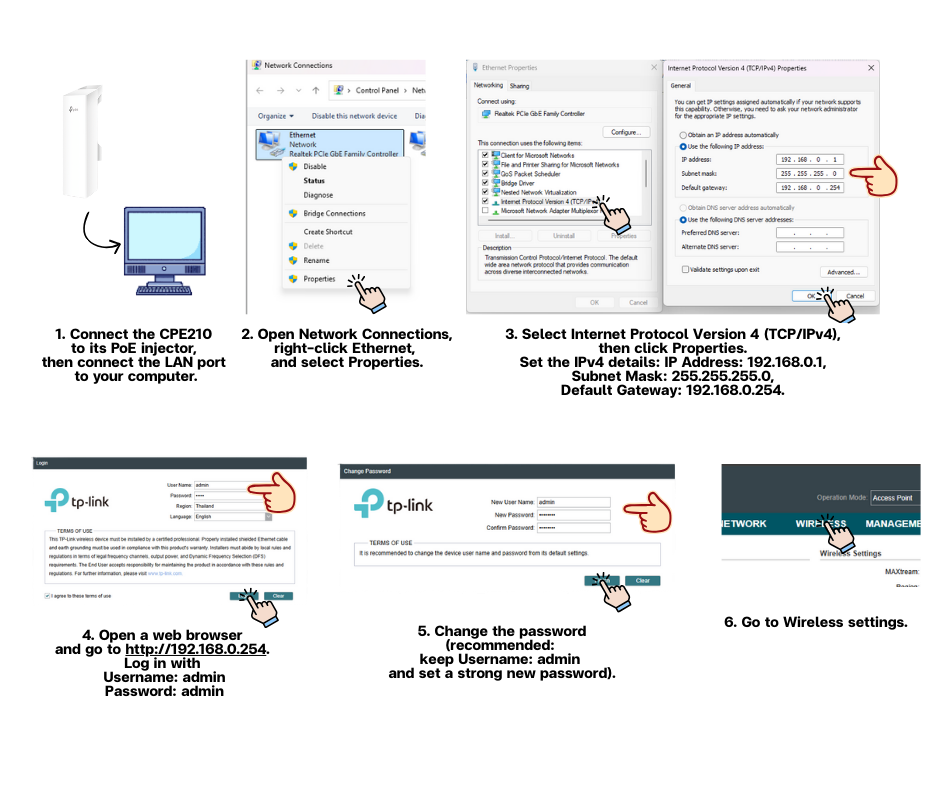
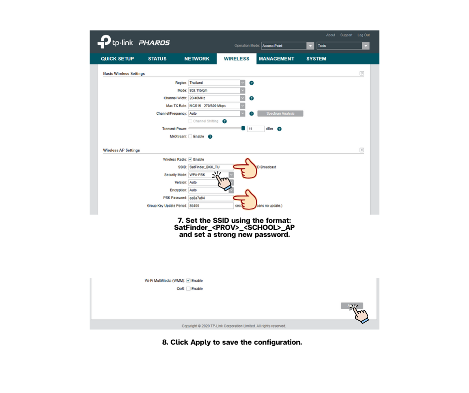

ภาษา: ไทย | [English](./README.md)

# SatFinder TinyGS Node (LILYGO LoRa32 433 + TP-Link CPE210 + Eggbeater)

ที่เก็บนี้เป็น **คู่มือประกอบ/ติดตั้งแบบไฟล์เดียวครบวงจร** สำหรับติดตั้งโหนด SatFinder LoRa โดยใช้:

- เฟิร์มแวร์ **TinyGS** (แฟลชผ่าน Web Installer)
- **LILYGO LoRa32 433 MHz (T3_V1.6.1)** (มี **SMA female** ในตัว)
- **TP-Link CPE210** (มี **3.3V header** บนบอร์ดเพื่อจ่ายไฟให้ LILYGO)
- **433 MHz Eggbeater Antenna** (มาตรฐาน SatFinder)
- สาย **SMA ↔ N-Type RF cable (~50 cm)** ที่ให้มา โดยเดินจากด้านใน CPE210 ออกสู่ด้านนอก แล้วต่อเข้ากับ Eggbeater โดยตรง

---

## 1) ขอบเขตและแนวทางการออกแบบ

### สิ่งที่ repo นี้ครอบคลุม
- ตั้งค่า **CPE210 Wi-Fi SSID/Password (2.4 GHz)** ตามกฎการตั้งชื่อของ SatFinder
- เชื่อมต่อ **CPE210 เข้ากับ PoE adapter ที่ให้มา** และ **อินเทอร์เน็ตอัปลิงก์ที่ไม่ต้องยืนยันตัวตน**
- แฟลช **TinyGS** ลงบน LILYGO LoRa32 (T3_V1.6.1, 433 MHz) ผ่าน official web installer
- การประกอบเชิงกลภายในกล่อง TP-Link CPE210
- จ่ายไฟให้ LILYGO จาก **3.3V header** ของ CPE210 ด้วยสาย **JST-SH 1.25** ที่ให้มา
- เดินสาย RF ของ LoRa ออกจากกล่องด้วยสาย **SMA-to-N Type** ที่ให้มา ไปยัง **Eggbeater antenna**
- มาตรฐานการตั้งชื่อสถานีและกฎรหัส SCHOOL ที่แนะนำ

### สิ่งที่ repo นี้ไม่ครอบคลุม
- การวางแผนเครือข่ายและสำรวจหน้างาน (RF path planning / Wi-Fi link design)
- การจูน TinyGS ขั้นสูง (SF/BW/CR optimization)
- ชิ้นส่วน Custom PCB/3D printed (เป็นทางเลือกเท่านั้น)

---

## 2) รายการอุปกรณ์ (BOM)

### จำเป็น
- **LILYGO LoRa32 433 MHz (T3_V1.6.1)** พร้อม **SMA female** ในตัว
- **TP-Link CPE210** (มี **3.3V header** บนบอร์ด)
- สาย **JST-SH 1.25 (2-pin)** (ให้มาพร้อม LILYGO)
- **433 MHz Eggbeater Antenna** (มาตรฐาน SatFinder)
- สาย **SMA ↔ N-Type RF cable (~50 cm)** (จัดหาโดย SatFinder)
- **PoE adapter/injector** (มากับ CPE210)

### เครื่องมือ
- ไขควง (สำหรับเปิด CPE210)
- มัลติมิเตอร์ (แนะนำอย่างยิ่งเพื่อยืนยัน 3.3V และขั้วก่อนเชื่อมต่อ)

> ไม่ได้ใช้ในงานประกอบนี้: เครื่องมือเจาะ/ตัด, คีมย้ำ, คีมปอกสาย, น็อต/โบลต์/แหวนรอง (ตาม workflow ของชุด SatFinder)

---

## 3) ตั้งค่า Wi-Fi TP-Link CPE210 (SSID/Password) — 2.4 GHz

ให้ตั้งค่า CPE210 ก่อน เพื่อให้ TinyGS node เชื่อมต่อเครือข่าย Wi-Fi ที่ถูกต้องได้อย่างเสถียรเมื่อใช้งานภาคสนาม

### 3.1 กฎการตั้งชื่อ Wi-Fi (มาตรฐานโครงการ)
- **Band**: 2.4 GHz
- **CPE210 SSID**: ใช้ **ข้อความเดียวกันกับชื่อ SatFinder node**
  - รูปแบบ: `SatFinder_<PROV>_<SCHOOL>`
- **CPE210 Password (WPA2-PSK)**: `aa8a7a94` (ค่าคงที่สำหรับ SatFinder ทุกโหนด)

ตัวอย่าง:
- ชื่อ Node/Station: `SatFinder_CMI_TU`
- CPE210 SSID: `SatFinder_CMI_TU`
- CPE210 Password: `aa8a7a94`

### 3.2 ขั้นตอนแบบทีละข้อ (ค่าพื้นฐานที่แนะนำ)
1. เปิดไฟ CPE210 (ดู Section 4) และต่อแล็ปท็อป/พีซีเพื่อเริ่มตั้งค่า
2. ล็อกอินเข้าหน้า CPE210 management interface (IP/URL อาจแตกต่างตามการตั้งค่า)
3. ไปที่การตั้งค่า **Wireless**:
   - ตั้ง **Wireless Mode / Radio** เป็น **2.4 GHz** (CPE210 ออกแบบมาสำหรับ 2.4 GHz)
   - ตั้ง **SSID** เป็น `SatFinder_<PROV>_<SCHOOL>`
   - ตั้ง **Security** เป็น **WPA2-PSK (AES)** (แนะนำ)
   - ตั้ง **Password** เป็น `aa8a7a94`
4. บันทึก/ใช้งานการตั้งค่า และยืนยันว่าเห็น SSID ในผลสแกน Wi-Fi
5. (แนะนำ) ปิดฟีเจอร์ที่อาจทำให้เกิดปัญหาในภาคสนาม:
   - หลีกเลี่ยงฟีเจอร์หน้าเข้าสู่ระบบเครือข่าย (captive portal) / web authentication (ถ้ามี)
   - ตรวจสอบว่าเปิดกระจาย SSID (ไม่ซ่อน) เพื่อให้ปฏิบัติงานภาคสนามได้ง่าย

> หมายเหตุการปฏิบัติการ: การใช้ SSID เดียวกับชื่อโหนดช่วยให้ระบุตัวตนง่ายขึ้นและลดการเชื่อมต่อผิดพลาดระหว่างหลายไซต์

---

## 4) เชื่อมต่อ CPE210 กับ PoE Adapter และอินเทอร์เน็ตอัปลิงก์ (ไม่ต้องยืนยันตัวตน)

TinyGS ต้องใช้อินเทอร์เน็ตตามปกติ และ **ไม่รองรับขั้นตอนยืนยันตัวตนเครือข่าย** (เช่น captive portal login, 802.1X, web-based sign-in)

### 4.1 การต่อสาย PoE adapter (ที่มากับ CPE210)
พอร์ตบน PoE injector ทั่วไป:
- **LAN** (รับ data จากเครือข่าย)
- **PoE** (ส่ง data + power ไป CPE210)

ขั้นตอน:
1. ต่อสาย Ethernet จากพอร์ต **PoE** ของ injector ไปยัง **Ethernet port บน CPE210**
2. ต่อสาย Ethernet จากเครือข่ายโรงเรียน/แหล่งอินเทอร์เน็ต ไปยังพอร์ต **LAN** ของ injector
3. เสียบอะแดปเตอร์ไฟของ injector เข้ากับไฟบ้าน AC

### 4.2 ข้อกำหนดอินเทอร์เน็ตอัปลิงก์ (สำคัญ)
- Ethernet uplink ที่ต่อเข้าพอร์ต **LAN** ของ injector ต้องให้อินเทอร์เน็ตได้ **โดยไม่ต้องยืนยันตัวตนใด ๆ** เช่น:
  - Captive portal (หน้า browser ให้ล็อกอิน)
  - 802.1X / enterprise authentication
  - PPPoE credentials
  - ขั้นตอนเว็บ sign-in ใด ๆ

**แนวทางที่แนะนำสำหรับโรงเรียน**
- ใช้พอร์ตจาก router/switch ปกติที่ให้ DHCP + Internet ได้โดยตรง (ไม่ต้อง sign-in)
- หากเครือข่ายโรงเรียนต้องยืนยันตัวตน ให้มีเราเตอร์ขนาดเล็กแยกไว้ด้าน upstream เพื่อจัดการการยืนยันตัวตน (ถ้ามี) และปล่อย LAN แบบ NAT/DHCP ปกติให้ CPE210

### 4.3 เช็กลิสต์ยืนยันแบบรวดเร็ว
- แล็ปท็อปที่ต่อ uplink เดียวกันสามารถเปิดเว็บไซต์ทั่วไปได้ **โดยไม่ต้อง** ล็อกอิน
- ได้รับ DHCP lease ตามปกติ
- ไม่มีข้อความ “Sign in to network” บนอุปกรณ์ลูกข่าย

---

## 5) แฟลช TinyGS บน LILYGO (Web Installer)

### 5.1 สิ่งที่ต้องมี
- เบราว์เซอร์: **Chrome** หรือ **Microsoft Edge** (รองรับ Web Serial)
- สาย USB ที่เสถียร (หลีกเลี่ยง data drop ระหว่างแฟลช)

### 5.2 ขั้นตอนแฟลช
1. ต่อบอร์ด LILYGO เข้ากับคอมพิวเตอร์ผ่าน USB
2. เปิด TinyGS Web Installer ทางการ:  
   https://installer.tinygs.com/
3. เลือก device/board profile ที่ถูกต้องสำหรับ **ESP32 + SX127x** (ตระกูล LILYGO LoRa32)
4. คลิก **Install/Flash** แล้วเลือก serial port (COM) ที่ถูกต้อง
5. รอจนกระบวนการเสร็จสิ้น (ห้ามถอด USB ระหว่างแฟลช)

### 5.3 เช็กลิสต์การตั้งค่าเริ่มต้น (provisioning) หลังแฟลช
- ตั้งค่า TinyGS Wi-Fi SSID / Password ให้ตรงกับ Section 3:
  - SSID: `SatFinder_<PROV>_<SCHOOL>`
  - Password: `aa8a7a94`
- ยืนยันว่า LoRa region/frequency plan เป็น **433 MHz**
- ตั้งชื่อสถานี/อุปกรณ์ตามกฎการตั้งชื่อของ SatFinder (Section 8)

### 5.4 เพิ่มอุปกรณ์เข้า TinyGS (Register New Station ผ่าน Telegram)

หลังตั้งค่าเริ่มต้น (provisioning) เสร็จ (Wi-Fi / LoRa / station naming) ต้อง **ลงทะเบียนอุปกรณ์เป็นสถานีใหม่** ในระบบ TinyGS

#### Steps
1. **อ่านและจด OTP code** ที่แสดงบนหน้าจอ **OLED** ของ LILYGO (TinyGS จะแสดง OTP สำหรับลงทะเบียน)
2. ติดตั้ง **Telegram** บนโทรศัพท์มือถือ แล้วเข้ากลุ่ม TinyGS Telegram:
   - https://t.me/joinchat/DmYSElZahiJGwHX6jCzB3Q
3. เปิด **private chat** กับ: `@tinygs_personal_bot`
4. พิมพ์คำสั่ง:
   - `/weblogin`  
   บอทจะตอบกลับเป็น **TinyGS Web Login URL**
5. เปิด URL แล้วคลิก **New Station**
6. กรอกแบบฟอร์มลงทะเบียนสถานี:
   - **Station Name**: ให้ใช้รูปแบบชื่อโครงการ: `SatFinder_<PROV>_<SCHOOL>`
   - **OTP Code**: ใช้ OTP ที่จดจาก OLED
   - **Latitude / Longitude**: ใช้พิกัดโรงเรียน (แนะนำ decimal degrees)
   - **Time Zone**: `Asia/Bangkok`
   - **Admin Password** และ **Confirm Password**: ตั้งรหัสผ่านผู้ดูแลสำหรับจัดการสถานี
7. คลิก **Create Station**
8. คลิก **Done**

### 5.5 ตั้งค่า Wireless Access Point (AP)

#### Steps
1. ต่อ CPE210 เข้ากับ PoE injector แล้วต่อพอร์ต LAN เข้ากับคอมพิวเตอร์
2. เปิด **Network Connections** คลิกขวา **Ethernet** แล้วเลือก **Properties**
3. เลือก **Internet Protocol Version 4 (TCP/IPv4)** แล้วคลิก **Properties**
4. ตั้งค่า IPv4: **IP Address:** 192.168.0.1, **Subnet Mask:** 255.255.255.0, **Default Gateway:** 192.168.0.254.
5. เปิดเว็บเบราว์เซอร์ไปที่ **[http://192.168.0.254](http://192.168.0.254)** แล้วล็อกอินด้วย **Username:** admin, **Password:** admin.
6. เปลี่ยนรหัสผ่าน (แนะนำ: คง **Username: admin** และตั้งรหัสผ่านใหม่ที่แข็งแรง)
7. ไปที่การตั้งค่า **Wireless**
8. ตั้ง **SSID** ตามรูปแบบ: **SatFinder_<PROV>_<SCHOOL>_AP**.
9. คลิก **Apply** เพื่อบันทึกการตั้งค่า

#### หมายเหตุ (แนะนำ)
- ใช้ข้อความเดียวกันสำหรับ:
  - **Station Name (TinyGS)** = **CPE210 SSID** = `SatFinder_<PROV>_<SCHOOL>`
- สำหรับ Latitude/Longitude สามารถคัดลอกพิกัดจากบริการแผนที่ได้ (ตรวจสอบว่าจุดตรงกับตำแหน่งโรงเรียน)
- เก็บ Admin Password ให้ปลอดภัย (จำเป็นต่อการดูแลสถานีในอนาคต)

---

## 6) ประกอบ LILYGO เข้ากับ TP-Link CPE210

### 6.1 เปิด CPE210
1. ถอดไฟออกก่อน
2. เปิดฝาครอบอย่างระมัดระวัง (หลีกเลี่ยงความเสียหายต่อสายภายใน)
3. หา **3.3V header** บนบอร์ด CPE210 (onboard)

### 6.2 วาง LILYGO อย่างปลอดภัย
- ตรวจสอบว่าบอร์ด LILYGO **ไม่** สัมผัสพื้นผิวนำไฟฟ้า
- รองฉนวนใต้บอร์ด (เช่น แผ่นพลาสติกบาง / Kapton tape / insulation tape)
- จัดแนวสายไม่ให้ถูกหนีบตอนปิดฝา

---

## 7) การต่อไฟ: CPE210 3.3V Header → JST-SH 1.25 → LILYGO

**พฤติกรรมที่ยืนยันจากภาคสนาม (SatFinder build):**  
3.3V header บน CPE210 สามารถจ่ายไฟให้ LILYGO ได้เสถียรผ่านสาย JST-SH 1.25

### 7.1 หลักการเดินสาย
- **CPE210 3.3V** → **JST red wire** → LILYGO (JST-PH)
- **CPE210 GND** → **JST black wire** → LILYGO (JST-PH)

### 7.2 เช็กลิสต์ความปลอดภัย (แนะนำ)
- ยืนยัน polarity ที่ 3.3V header (ห้ามคาดเดา)
- ถ้าเป็นไปได้ให้ใช้มัลติมิเตอร์:
  - วัดได้ประมาณ ~3.3V ระหว่างขา 3.3V ที่ต้องการใช้กับ GND
- ต่อ JST หลังยืนยัน polarity แล้วเท่านั้น

### 7.3 ทดสอบเปิดระบบ
1. จ่ายไฟ CPE210 ตามปกติ
2. ยืนยันว่า LILYGO บูต (LED / สถานะ OLED / การเชื่อมต่อ TinyGS)
3. ยืนยันว่า TinyGS online หลังเชื่อม Wi-Fi สำเร็จ

---

## 8) เสาอากาศ LoRa และการเดินสาย RF (SMA → N-Type → Eggbeater)

### 8.1 มาตรฐานเสาอากาศ SatFinder
- ใช้ **433 MHz Eggbeater Antenna** เป็นเสามาตรฐาน LoRa ของ SatFinder

### 8.2 ขั้นตอนการเชื่อมต่อ RF
1. ภายใน CPE210:
   - ต่อด้าน **SMA end** ของสาย **SMA↔N Type (~50 cm)** ที่ให้มา เข้ากับ **SMA female** ของ LILYGO
2. เดินสายออกจาก CPE210:
   - ใช้ช่องออกสาย/ทางเดินสายที่มีอยู่ (workflow ชุดนี้ไม่ต้องเจาะ)
   - ระวังไม่ให้สายหักงอคมเกินไปหรือถูกขอบกล่องกดทับ
3. ภายนอก CPE210:
   - ต่อด้าน **N-Type end** เข้ากับ **Eggbeater antenna** โดยตรง

### 8.3 แนวทางปฏิบัติที่ดี
- หลีกเลี่ยงการหักงอ 90° ที่แน่นเกินไป ควรโค้งแบบนุ่มนวลเพื่อปกป้อง coax และหัวต่อ
- ทำ strain relief เพื่อไม่ให้หัวต่อ SMA บน LILYGO รับแรงเชิงกลโดยตรง

---

## 9) มาตรฐานการตั้งชื่อสถานี

### 9.1 รูปแบบการตั้งชื่อ
**SatFinder_`<PROV>`_`<SCHOOL>`**

- `<PROV>`: อักษรย่อจังหวัดในประเทศไทย  
- `<SCHOOL>`: อักษรย่อโรงเรียน (ตัวระบุที่กำกับโดยโครงการ)

### 9.2 แหล่งอ้างอิงอักษรย่อจังหวัด
https://th.wikipedia.org/wiki/รายชื่ออักษรย่อของจังหวัดในประเทศไทย

> คำแนะนำ: ควรใช้อักษรย่อแบบ **Roman/ASCII** เพื่อความเข้ากันได้สูงสุดกับ dashboard, logs และระบบ IoT

---

## 10) กฎ SCHOOL ที่แนะนำ (มาตรฐานโครงการ)

เพื่อป้องกันรหัส SCHOOL ซ้ำซ้อนหรือไม่สอดคล้องกันระหว่างการติดตั้งหลายจุด ให้ใช้กฎต่อไปนี้:

1) ใช้เฉพาะตัวพิมพ์ใหญ่ ASCII และตัวเลข: **[A–Z, 0–9]**  
2) ความยาว: **2–6 ตัวอักษร** (แนะนำ 3–5)  
3) ความไม่ซ้ำ: ต้องไม่ซ้ำภายในจังหวัดเดียวกัน (และควรไม่ซ้ำทั้งประเทศ)  
4) เมื่อใช้กับสถานีที่ติดตั้งแล้ว ห้ามเปลี่ยนโดยไม่มี migration plan (เพื่อคงข้อมูลบน dashboard และประวัติ)

---

## 11) ตัวอย่างอย่างรวดเร็ว (15 ตัวอย่างจากหลายภูมิภาค)

| Region (example) | Province | PROV (Roman) | SCHOOL (example) | Station Name / CPE210 SSID |
|---|---|---:|---:|---|
| Central | Bangkok | BKK | TUS | SatFinder_BKK_TUS |
| North | Chiang Mai | CMI | PWS | SatFinder_CMI-PWS |
| North | Chiang Rai | CRI | MHS | SatFinder_CRI-MHS |
| Lower North | Phitsanulok | PLK | SCS | SatFinder_PLK_SCS |
| West | Kanchanaburi | KRI | KWS | SatFinder_KRI_KWS |
| Central | Nakhon Pathom | NPT | NPS | SatFinder_NPT_NPS |
| East | Chonburi | CBI | CBS | SatFinder_CBI_CBS |
| East | Rayong | RYG | RYS | SatFinder_RYG_RYS |
| Northeast | Nakhon Ratchasima | NMA | NMS | SatFinder_NMA_NMS |
| Northeast | Khon Kaen | KKN | KKS | SatFinder_KKN_KKS |
| Northeast | Udon Thani | UDN | UDS | SatFinder_UDN_UDS |
| Northeast | Ubon Ratchathani | UBN | UBS | SatFinder_UBN_UBS |
| South (Andaman) | Phuket | PKT | PKS | SatFinder_PKT_PKS |
| South (Gulf) | Surat Thani | SNI | SNS | SatFinder_SNI_SNS |
| South | Songkhla | SKA | SKS | SatFinder_SKA_SKS |

---

## 12) เช็กลิสต์ตรวจรับขั้นสุดท้าย (ก่อนปิดกล่อง)

- [ ] ตั้ง CPE210 SSID เป็น `SatFinder_<PROV>_<SCHOOL>` (2.4 GHz) แล้ว
- [ ] ตั้งรหัสผ่าน CPE210 Wi-Fi เป็น `aa8a7a94` แล้ว
- [ ] ต่อ CPE210 กับ PoE injector ถูกต้อง (PoE → CPE210, LAN → Internet uplink)
- [ ] Internet uplink **ไม่ต้องยืนยันตัวตน** (ไม่มี captive portal / 802.1X / PPPoE / web sign-in)
- [ ] แฟลช TinyGS ผ่าน https://installer.tinygs.com/ แล้ว
- [ ] ตั้ง TinyGS Wi-Fi ให้ตรงกับ CPE210 SSID/password แล้ว
- [ ] ตั้งค่า LoRa frequency plan เป็น **433 MHz** แล้ว
- [ ] ชื่อสถานีเป็นไปตาม `SatFinder_<PROV>_<SCHOOL>`
- [ ] CPE210 จ่ายไฟให้ LILYGO ผ่าน **3.3V header → JST-SH 1.25** (ยืนยัน polarity แล้ว)
- [ ] สาย RF **SMA↔N (0.5 m)** ต่อและเดินสายอย่างปลอดภัยแล้ว
- [ ] N-Type ต่อเข้ากับ **Eggbeater antenna** โดยตรงแล้ว
- [ ] ไม่มีสายถูกหนีบเมื่อปิดกล่อง CPE210

---

## 13) การแก้ปัญหา (ปัญหาหน้างานที่พบบ่อย)

### CPE210 ติดลิงก์แต่ TinyGS ออกอินเทอร์เน็ตไม่ได้
- ยืนยันว่า Ethernet uplink ไม่ต้องยืนยันตัวตน (ไม่มี captive portal / 802.1X / PPPoE)
- ตรวจสอบว่า uplink ให้ DHCP + Internet โดยตรง
- ทดสอบด้วยแล็ปท็อป: ต้องเปิดเว็บไซต์ได้ **โดยไม่ต้อง** ล็อกอิน

### อุปกรณ์บูตแต่ TinyGS ยัง offline
- ตรวจสอบ Wi-Fi SSID/password และความครอบคลุมสัญญาณอีกครั้ง
- ยืนยันว่าแฟลชผ่าน web installer สำเร็จ
- ปิด-เปิดไฟ CPE210 ใหม่ และตรวจสอบว่า LILYGO บูตได้สม่ำเสมอ

### รีบูตสุ่ม / ทำงานไม่เสถียร
- ยืนยัน polarity ของ 3.3V header และความแน่นของหัวต่อ
- ตรวจสอบว่าไม่มีสายลัดวงจรกับโลหะ/กราวด์เป็นช่วง ๆ
- ปรับปรุงฉนวนและ strain relief

### รับสัญญาณ LoRa ได้ไม่ดี
- ยืนยันว่า Eggbeater สำหรับ 433 MHz และติดตั้งถูกต้อง
- ยืนยันว่าสาย coax ไม่หักงอคมหรือเสียหาย
- ย้ายตำแหน่งเสาให้ห่างสิ่งกีดขวางและแหล่ง EMI สูง

---

## License
MIT
