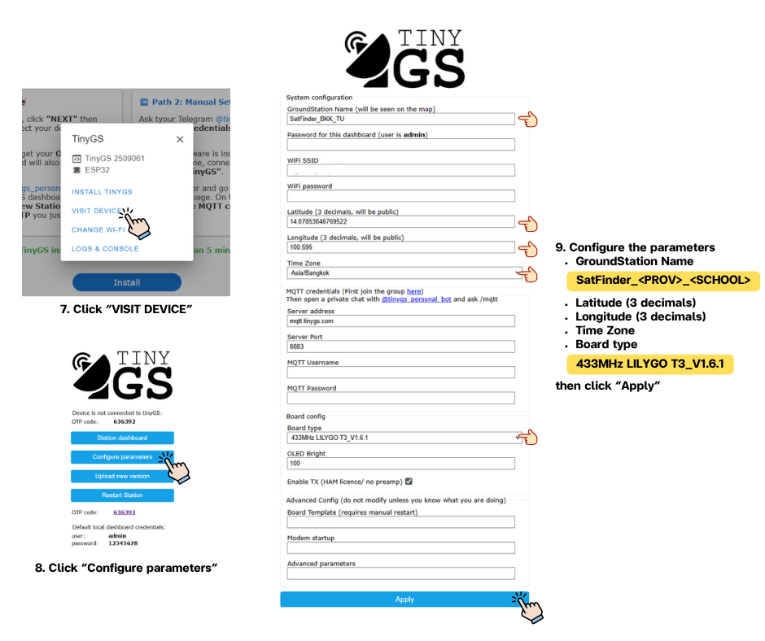
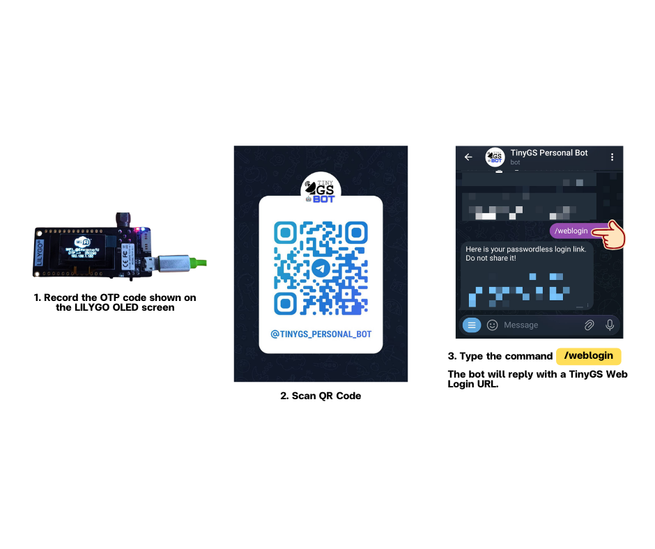
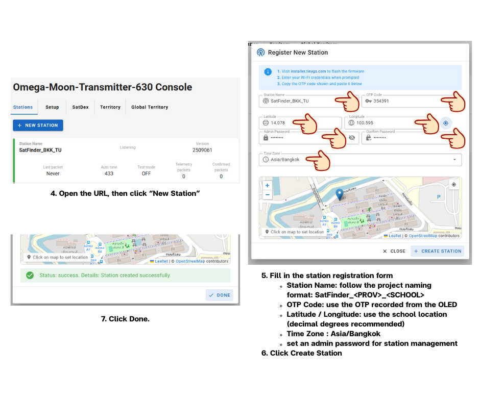
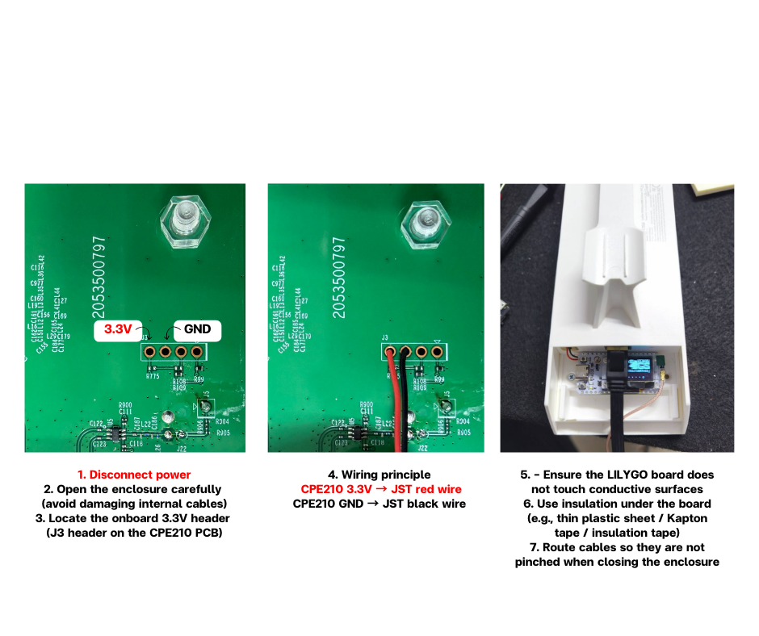

Revision: Rev2.0 | เวอร์ชันเก่า: [README.th Rev1.0](./README.th.rev1.0.md) | ภาษา: ไทย | [English](./README.md)

# SatFinder TinyGS Node (LILYGO LoRa32 433 + TP-Link CPE210 + Eggbeater)

ที่เก็บนี้เป็น **คู่มือประกอบ/ติดตั้งแบบไฟล์เดียวครบวงจร** สำหรับติดตั้งโหนด SatFinder LoRa โดยใช้:

- เฟิร์มแวร์ **TinyGS** แฟลชผ่าน Web Installer
- **LILYGO LoRa32 433 MHz (T3_V1.6.1)** พร้อม **SMA female** ในตัว
- **TP-Link CPE210** ที่โครงการ SatFinder ตั้งค่าเป็น Wi-Fi access point สำหรับโหนดไว้แล้ว
- **433 MHz Eggbeater Antenna** เป็นมาตรฐานเสาอากาศของ SatFinder
- สาย **SMA ↔ N-Type RF cable (~50 cm)** ที่ให้มา โดยเดินจากด้านใน CPE210 ออกสู่ด้านนอก แล้วต่อเข้ากับ Eggbeater โดยตรง

---

## 1) ขอบเขตและแนวทางการออกแบบ

### สิ่งที่ repo นี้ครอบคลุม
- ใช้ **CPE210 Wi-Fi SSID/password ที่โครงการตั้งไว้แล้ว** สำหรับ provisioning TinyGS
- เชื่อมต่อ **CPE210 เข้ากับ PoE adapter ที่ให้มา** และ **อินเทอร์เน็ตอัปลิงก์ที่ไม่ต้องยืนยันตัวตน**
- เลือก **ชื่อสถานี SatFinder** ให้ถูกต้องก่อนเริ่มแฟลชและ provisioning TinyGS
- แฟลช **TinyGS** ลงบน LILYGO LoRa32 (T3_V1.6.1, 433 MHz) ผ่าน official Web Installer
- ลงทะเบียนสถานีใหม่ใน TinyGS ผ่าน Telegram
- การประกอบเชิงกลภายในกล่อง TP-Link CPE210
- จ่ายไฟให้ LILYGO จาก **3.3V header** ของ CPE210 ด้วยสาย **JST-SH 1.25** ที่ให้มา
- เดินสาย RF ของ LoRa ออกจากกล่องด้วยสาย **SMA-to-N Type** ที่ให้มา ไปยัง **Eggbeater antenna**

### สิ่งที่ repo นี้ไม่ครอบคลุม
- การตั้งค่า Wi-Fi/AP บน CPE210 เพราะโครงการตั้งค่าไว้ให้แล้วก่อนใช้งานภาคสนาม
- การวางแผนเครือข่ายและสำรวจหน้างาน (RF path planning / Wi-Fi link design)
- การจูน TinyGS ขั้นสูง (SF/BW/CR optimization)
- ชิ้นส่วน Custom PCB/3D printed (เป็นทางเลือกเท่านั้น)

---

## 2) รายการอุปกรณ์ (BOM)

### จำเป็น
- **LILYGO LoRa32 433 MHz (T3_V1.6.1)** พร้อม **SMA female** ในตัว
- **TP-Link CPE210** พร้อม **3.3V header** บนบอร์ด
- สาย **JST-SH 1.25 (2-pin)** ที่ให้มาพร้อม LILYGO
- **433 MHz Eggbeater Antenna** มาตรฐาน SatFinder
- สาย **SMA ↔ N-Type RF cable (~50 cm)** จัดหาโดย SatFinder
- **PoE adapter/injector** ที่มากับ CPE210

### เครื่องมือ
- ไขควง สำหรับเปิด CPE210
- มัลติมิเตอร์ แนะนำอย่างยิ่งเพื่อยืนยัน 3.3V และขั้วก่อนเชื่อมต่อ

> ไม่ได้ใช้ในงานประกอบนี้: เครื่องมือเจาะ/ตัด, คีมย้ำ, คีมปอกสาย, น็อต/โบลต์/แหวนรอง ตาม workflow ของชุด SatFinder

---

## 3) ใช้ Wi-Fi ของ CPE210 ที่โครงการตั้งไว้แล้ว (ไม่ต้องตั้งค่า Wi-Fi)

โครงการ SatFinder ตั้งค่า Wi-Fi ของ TP-Link CPE210 ไว้ให้แล้วก่อนนำไปใช้งาน ดังนั้น **ไม่ต้องเปลี่ยนชื่อ Wi-Fi** ระหว่างประกอบโหนด

- **CPE210 SSID**: `SatFinder_<MAC_LAST6>`
- **MAC_LAST6**: ตัวอักษร/ตัวเลขฐานสิบหก 6 ตัวท้ายของ MAC Address บนสติ๊กเกอร์ด้านหลัง TP-Link CPE210 โดยไม่รวมเครื่องหมายคั่น เช่น `:` หรือ `-`
- **รหัสผ่าน Wi-Fi**: `aa8a7a94`
- **ย่านความถี่**: 2.4 GHz

ตัวอย่าง:
- MAC บนสติ๊กเกอร์: `AA:BB:CC:12:34:56`
- MAC 6 ตัวท้ายแบบไม่รวมเครื่องหมายคั่น: `123456`
- CPE210 SSID: `SatFinder_123456`
- Password: `aa8a7a94`

ให้จด SSID จากสติ๊กเกอร์ก่อนเริ่ม provisioning TinyGS โดย SSID นี้ใช้สำหรับเชื่อมต่อเครือข่ายเท่านั้น ส่วนชื่อสถานี TinyGS ยังต้องตั้งตามรูปแบบ SatFinder ใน Section 5

---

## 4) เชื่อมต่อ CPE210 กับ PoE Adapter และอินเทอร์เน็ตอัปลิงก์ (ไม่ต้องยืนยันตัวตน)

TinyGS ต้องใช้อินเทอร์เน็ตตามปกติ และ **ไม่รองรับขั้นตอนยืนยันตัวตนเครือข่าย** เช่น captive portal login, 802.1X หรือ web-based sign-in

### 4.1 การต่อสาย PoE adapter
พอร์ตบน PoE injector ทั่วไป:
- **LAN**: รับ data จากเครือข่าย
- **PoE**: ส่ง data + power ไป CPE210

ขั้นตอน:
1. ต่อสาย Ethernet จากพอร์ต **PoE** ของ injector ไปยัง **Ethernet port บน CPE210**
2. ต่อสาย Ethernet จากเครือข่ายโรงเรียน/แหล่งอินเทอร์เน็ต ไปยังพอร์ต **LAN** ของ injector
3. เสียบอะแดปเตอร์ไฟของ injector เข้ากับไฟบ้าน AC

### 4.2 ข้อกำหนดอินเทอร์เน็ตอัปลิงก์
Ethernet uplink ที่ต่อเข้าพอร์ต **LAN** ของ injector ต้องให้อินเทอร์เน็ตได้ **โดยไม่ต้องยืนยันตัวตนใด ๆ** เช่น:
- Captive portal หรือหน้า browser ให้ล็อกอิน
- 802.1X / enterprise authentication
- PPPoE credentials
- ขั้นตอนเว็บ sign-in ใด ๆ

**แนวทางที่แนะนำสำหรับโรงเรียน**
- ใช้พอร์ตจาก router/switch ปกติที่ให้ DHCP + Internet ได้โดยตรง
- หากเครือข่ายโรงเรียนต้องยืนยันตัวตน ให้ใช้เราเตอร์ขนาดเล็กด้าน upstream เพื่อจัดการการยืนยันตัวตน และปล่อย LAN แบบ NAT/DHCP ปกติให้ CPE210

### 4.3 เช็กลิสต์ยืนยันแบบรวดเร็ว
- แล็ปท็อปที่ต่อ uplink เดียวกันเปิดเว็บไซต์ทั่วไปได้โดยไม่ต้องล็อกอิน
- ได้รับ DHCP lease ตามปกติ
- ไม่มีข้อความ “Sign in to network” บนอุปกรณ์ลูกข่าย

---

## 5) มาตรฐานการตั้งชื่อสถานีและตัวอย่าง

ให้เลือกชื่อสถานี **ก่อน** เริ่มแฟลช/provisioning TinyGS และใช้ชื่อเดียวกันทั้งในขั้นตอน TinyGS local configuration และตอนลงทะเบียนสถานีใน TinyGS

### 5.1 รูปแบบชื่อและกฎ SCHOOL
**SatFinder_`<PROV>`_`<SCHOOL>`**

- `<PROV>`: อักษรย่อจังหวัดในประเทศไทย
- `<SCHOOL>`: อักษรย่อโรงเรียนที่กำกับโดยโครงการ

กฎที่แนะนำ:
1. ใช้เฉพาะตัวพิมพ์ใหญ่ ASCII และตัวเลข: **[A-Z, 0-9]**
2. ความยาว `<SCHOOL>`: **2-6 ตัวอักษร** แนะนำ 3-5 ตัวอักษร
3. ความไม่ซ้ำ: `<SCHOOL>` ควรไม่ซ้ำภายในจังหวัดเดียวกัน และถ้าเป็นไปได้ควรไม่ซ้ำทั้งประเทศ
4. เมื่อใช้กับสถานีที่ติดตั้งแล้ว ไม่ควรเปลี่ยนชื่อโดยไม่มี migration plan

แหล่งอ้างอิงอักษรย่อจังหวัด:
https://th.wikipedia.org/wiki/รายชื่ออักษรย่อของจังหวัดในประเทศไทย

> คำแนะนำ: ควรใช้อักษรย่อแบบ Roman/ASCII เพื่อให้เข้ากันได้ดีกับ dashboard, logs และระบบ IoT

### 5.2 ตัวอย่างอย่างรวดเร็ว

| Region (example) | Province | PROV (Roman) | SCHOOL (example) | TinyGS Station Name |
|---|---|---:|---:|---|
| Central | Bangkok | BKK | TUS | SatFinder_BKK_TUS |
| North | Chiang Mai | CMI | PWS | SatFinder_CMI_PWS |
| North | Chiang Rai | CRI | MHS | SatFinder_CRI_MHS |
| Lower North | Phitsanulok | PLK | SCS | SatFinder_PLK_SCS |
| West | Kanchanaburi | KRI | KWS | SatFinder_KRI_KWS |
| Central | Nakhon Pathom | NPT | NPS | SatFinder_NPT_NPS |
| East | Chonburi | CBI | CBS | SatFinder_CBI_CBS |
| East | Rayong | RYG | RYS | SatFinder_RYG_RYS |
| Northeast | Nakhon Ratchasima | NMA | NMS | SatFinder_NMA_NMS |
| Northeast | Khon Kaen | KKN | KKS | SatFinder_KKN_KKS |
| Northeast | Udon Thani | UDN | UDS | SatFinder_UDN_UDS |
| Northeast | Ubon Ratchathani | UBN | UBS | SatFinder_UBN_UBS |
| South (Andaman) | Phuket | PKT | PKS | SatFinder_PKT_PKS |
| South (Gulf) | Surat Thani | SNI | SNS | SatFinder_SNI_SNS |
| South | Songkhla | SKA | SKS | SatFinder_SKA_SKS |

---

## 6) แฟลช TinyGS บน LILYGO (Web Installer)

### 6.1 สิ่งที่ต้องมี
- เบราว์เซอร์: **Chrome** หรือ **Microsoft Edge** ที่รองรับ Web Serial
- สาย USB data ที่เสถียร

### 6.2 ขั้นตอนแฟลชและตั้งค่าเริ่มต้น
1. ต่อบอร์ด LILYGO เข้ากับคอมพิวเตอร์ผ่าน USB
2. เปิด TinyGS Web Installer ทางการ:  
   https://installer.tinygs.com/
3. เลือก device/board profile ที่ถูกต้องสำหรับ **ESP32 + SX127x** (ตระกูล LILYGO LoRa32)
4. คลิก **Install/Flash** แล้วเลือก serial port (COM) ที่ถูกต้อง
5. รอจนแฟลชเสร็จสิ้น ห้ามถอด USB ระหว่างแฟลช
6. ในขั้นตอน TinyGS local configuration ให้ตั้งค่า Wi-Fi:
   - **SSID**: `SatFinder_<MAC_LAST6>` จากสติ๊กเกอร์ CPE210
   - **Password**: `aa8a7a94`
7. ตั้ง LoRa region/frequency plan เป็น **433 MHz**
8. ตั้งชื่อสถานี/อุปกรณ์ TinyGS ตามรูปแบบที่เลือกไว้ใน Section 5: `SatFinder_<PROV>_<SCHOOL>`
9. บันทึก/ใช้งานการตั้งค่า รีบูตหากระบบแจ้ง และยืนยันว่าอุปกรณ์ online ได้

### 6.3 ลงทะเบียนสถานีใหม่ผ่าน Telegram

หลัง provisioning เสร็จ ให้ลงทะเบียนอุปกรณ์เป็นสถานีใหม่ในระบบ TinyGS

1. อ่านและจด OTP code ที่แสดงบนหน้าจอ **OLED** ของ LILYGO
2. ติดตั้ง **Telegram** บนโทรศัพท์มือถือ แล้วเข้ากลุ่ม TinyGS Telegram:
   - https://t.me/joinchat/DmYSElZahiJGwHX6jCzB3Q
3. เปิด private chat กับ `@tinygs_personal_bot`
4. พิมพ์คำสั่ง:
   - `/weblogin`  
   บอทจะตอบกลับเป็น TinyGS Web Login URL
5. เปิด URL แล้วคลิก **New Station**
6. กรอกแบบฟอร์มลงทะเบียนสถานี:
   - **Station Name**: ใช้ชื่อ `SatFinder_<PROV>_<SCHOOL>` เดียวกับที่เลือกไว้ใน Section 5
   - **OTP Code**: ใช้ OTP ที่จดจาก OLED
   - **Latitude / Longitude**: ใช้พิกัดโรงเรียน แนะนำรูปแบบ decimal degrees
   - **Time Zone**: `Asia/Bangkok`
   - **Admin Password** และ **Confirm Password**: ตั้งรหัสผ่านผู้ดูแลสำหรับจัดการสถานี
7. คลิก **Create Station**
8. คลิก **Done**

เก็บ Admin Password ให้ปลอดภัย เพราะจำเป็นต่อการดูแลสถานีในอนาคต

---

## 7) ประกอบ LILYGO เข้ากับ TP-Link CPE210

### 7.1 เปิด CPE210
1. ถอดไฟออกก่อน
2. เปิดฝาครอบอย่างระมัดระวัง และหลีกเลี่ยงความเสียหายต่อสายภายใน
3. หา **3.3V header** บนบอร์ด CPE210

### 7.2 วาง LILYGO อย่างปลอดภัย
- ตรวจสอบว่าบอร์ด LILYGO **ไม่** สัมผัสพื้นผิวนำไฟฟ้า
- รองฉนวนใต้บอร์ด เช่น แผ่นพลาสติกบาง, Kapton tape หรือ insulation tape
- จัดแนวสายไม่ให้ถูกหนีบตอนปิดฝา

---

## 8) การต่อไฟ: CPE210 3.3V Header → JST-SH 1.25 → LILYGO

**พฤติกรรมที่ยืนยันจากภาคสนาม (SatFinder build):**  
3.3V header บน CPE210 สามารถจ่ายไฟให้ LILYGO ได้เสถียรผ่านสาย JST-SH 1.25

### 8.1 หลักการเดินสาย
- **CPE210 3.3V** → **JST red wire** → LILYGO (JST-PH)
- **CPE210 GND** → **JST black wire** → LILYGO (JST-PH)

### 8.2 เช็กลิสต์ความปลอดภัย
- ยืนยัน polarity ที่ 3.3V header
- ถ้าเป็นไปได้ให้ใช้มัลติมิเตอร์วัดประมาณ 3.3V ระหว่างขา 3.3V ที่ต้องการใช้กับ GND
- ต่อ JST หลังยืนยัน polarity แล้วเท่านั้น

### 8.3 ทดสอบเปิดระบบ
1. จ่ายไฟ CPE210 ตามปกติ
2. ยืนยันว่า LILYGO บูตจาก LED, สถานะ OLED หรือสถานะ TinyGS
3. ยืนยันว่า TinyGS online หลังเชื่อม Wi-Fi สำเร็จ

---

## 9) เสาอากาศ LoRa และการเดินสาย RF (SMA → N-Type → Eggbeater)

### 9.1 มาตรฐานเสาอากาศ SatFinder
- ใช้ **433 MHz Eggbeater Antenna** เป็นเสามาตรฐาน LoRa ของ SatFinder

### 9.2 ขั้นตอนการเชื่อมต่อ RF
1. ภายใน CPE210:
   - ต่อด้าน **SMA end** ของสาย **SMA ↔ N Type (~50 cm)** ที่ให้มา เข้ากับ **SMA female** ของ LILYGO
2. เดินสายออกจาก CPE210:
   - ใช้ช่องออกสาย/ทางเดินสายที่มีอยู่ workflow ชุดนี้ไม่ต้องเจาะ
   - ระวังไม่ให้สายหักงอคมเกินไปหรือถูกขอบกล่องกดทับ
3. ภายนอก CPE210:
   - ต่อด้าน **N-Type end** เข้ากับ **Eggbeater antenna** โดยตรง

### 9.3 แนวทางปฏิบัติที่ดี
- หลีกเลี่ยงการหักงอ 90° ที่แน่นเกินไป ควรโค้งแบบนุ่มนวลเพื่อปกป้อง coax และหัวต่อ
- ทำ strain relief เพื่อไม่ให้หัวต่อ SMA บน LILYGO รับแรงเชิงกลโดยตรง

---

## 10) เช็กลิสต์ตรวจรับขั้นสุดท้าย

- [ ] จด CPE210 project Wi-Fi SSID จากสติ๊กเกอร์แล้ว: `SatFinder_<MAC_LAST6>`
- [ ] ใช้รหัสผ่าน CPE210 Wi-Fi สำหรับ TinyGS: `aa8a7a94`
- [ ] ต่อ CPE210 กับ PoE injector ถูกต้อง: PoE → CPE210, LAN → Internet uplink
- [ ] Internet uplink **ไม่ต้องยืนยันตัวตน**: ไม่มี captive portal / 802.1X / PPPoE / web sign-in
- [ ] แฟลช TinyGS ผ่าน https://installer.tinygs.com/ แล้ว
- [ ] ตั้ง TinyGS Wi-Fi เป็น SSID จากสติ๊กเกอร์ CPE210 และรหัสผ่านโครงการแล้ว
- [ ] ตั้งค่า LoRa frequency plan เป็น **433 MHz** แล้ว
- [ ] ชื่อสถานี TinyGS เป็นไปตาม `SatFinder_<PROV>_<SCHOOL>`
- [ ] ลงทะเบียนสถานีใน TinyGS ด้วย OLED OTP และชื่อสถานีเดียวกันแล้ว
- [ ] CPE210 จ่ายไฟให้ LILYGO ผ่าน **3.3V header → JST-SH 1.25** หลังยืนยัน polarity แล้ว
- [ ] สาย RF **SMA ↔ N (0.5 m)** ต่อและเดินสายอย่างปลอดภัยแล้ว
- [ ] N-Type ต่อเข้ากับ **Eggbeater antenna** โดยตรงแล้ว
- [ ] ไม่มีสายถูกหนีบเมื่อปิดกล่อง CPE210

---

## 11) การแก้ปัญหา

### มองไม่เห็น CPE210 Wi-Fi SSID
- ยืนยันว่า CPE210 ได้รับไฟผ่าน PoE injector แล้ว
- ยืนยันว่า SSID ที่ต้องหาใช้ MAC 6 ตัวท้ายจากสติ๊กเกอร์แบบไม่รวมเครื่องหมายคั่น: `SatFinder_<MAC_LAST6>`
- ยืนยันว่าอุปกรณ์ลูกข่ายสแกน Wi-Fi 2.4 GHz ได้

### CPE210 ติดลิงก์แต่ TinyGS ออกอินเทอร์เน็ตไม่ได้
- ยืนยันว่า Ethernet uplink ไม่ต้องยืนยันตัวตน
- ตรวจสอบว่า uplink ให้ DHCP + Internet โดยตรง
- ทดสอบด้วยแล็ปท็อป: ต้องเปิดเว็บไซต์ได้โดยไม่ต้องล็อกอิน

### อุปกรณ์บูตแต่ TinyGS ยัง offline
- ตรวจสอบ TinyGS Wi-Fi SSID/password อีกครั้ง
- ยืนยันว่า SSID มาจากสติ๊กเกอร์ CPE210 ไม่ใช่ชื่อสถานี TinyGS
- ยืนยันว่าแฟลชผ่าน Web Installer สำเร็จ
- ปิด-เปิดไฟ CPE210 ใหม่ และตรวจสอบว่า LILYGO บูตได้สม่ำเสมอ

### รีบูตสุ่ม / ทำงานไม่เสถียร
- ยืนยัน polarity ของ 3.3V header และความแน่นของหัวต่อ
- ตรวจสอบว่าไม่มีสายลัดวงจรกับโลหะ/กราวด์เป็นช่วง ๆ
- ปรับปรุงฉนวนและ strain relief

### รับสัญญาณ LoRa ได้ไม่ดี
- ยืนยันว่า Eggbeater สำหรับ 433 MHz และติดตั้งถูกต้อง
- ยืนยันว่าสาย coax ไม่หักงอคมหรือเสียหาย
- ย้ายตำแหน่งเสาให้ห่างสิ่งกีดขวางและแหล่ง EMI สูง

---

## License
MIT
